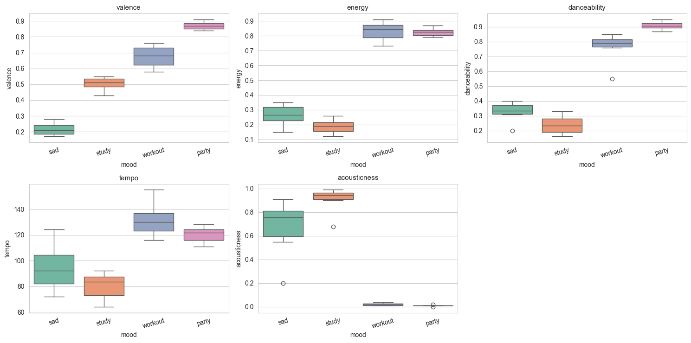

# music-label-project
# 🎵 Music Tag Analysis

面向音乐标签运营的个人项目，模拟「人工标注 → 特征分析 → 自动打标 → 验收」的闭环链路。

## 核心问题
如何将主观的音乐感受转化为可规模化的结构化标签？

## 方法
- 按 4 种情绪/场景（sad / study / workout / party）构建样本数据集
- 提取每首歌的 5 维声学特征（valence, energy, tempo 等）
- 可视化各标签的特征分布边界
- 构建规则型 auto-tagger，模拟模型推理与人工验收

## 关键发现
| mood | valence | energy | tempo |
|------|---------|--------|-------|
| sad     | 0.22 | 0.24 | 95  |
| study  | 0.49 | 0.19 | 80  |
| workout| 0.67 | 0.82 | 132 |
| party  | 0.87 | 0.83 | 121 |

- **valence（愉悦度）** 是区分低落系与欢快系的一个重要维度
- study 与 sad 在 energy 上重叠 → 纯声学特征存在场景歧义，需多模态信号（歌词、上下文）辅助
- 标签体系应包含 **多维度组合 + 人工抽检闭环**

## 可视化

